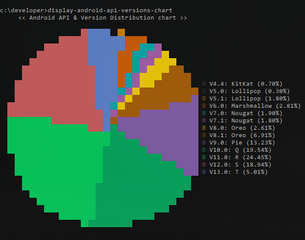

# android-api-versions-console-chart
Android api versions percentage usage chart for displaying in javascript/terminal using nodejs.


## Usage
To use android-api-versions-console-chart **on the terminal with node.js**, install [android-api-versions-console-chart from npm](https://www.npmjs.org/package/android-api-versions-console-chart) using the following command in the terminal:

```bash
npm install -g android-api-versions-console-chart
```
After installed, run the following command:

```bash
display-android-api-versions-chart
```

The result is as follows:




## Used libraries / Dependencies:

| Dependency library                                                | About                                                   |
|-------------------------------------------------------------------|---------------------------------------------------------|
| Random Color ([npmjs](https://www.npmjs.com/package/randomcolor)) | A tiny script for generating attractive random colors.  |
| Node Fetch ([npmjs](https://www.npmjs.com/package/node-fetch))    | A light-weight module that brings Fetch API to Node.js. |
| cli-pie ([npmjs](https://www.npmjs.com/package/cli-pie))          | Generate pie charts in terminal and text mode.          |

## Spread the word

If you like this library, please tell others about it :thumbsup::thumbsup:

<a href="https://twitter.com/intent/tweet?text=Trying%20to%20show%20relative%20date%20time%20texts%3F%20Check%20out%20this%20awesome%20library%20on%20Github%3A%20https://github.com/marlonlom/timeago" target="_blank" title="share to twitter" style="width:100%">
<a href="https://plus.google.com/share?url=https://github.com/marlonlom/timeago" target="_blank" title="share to G+" style="width:100%">
<a href="https://www.facebook.com/sharer/sharer.php?u=https://github.com/marlonlom/timeago" target="_blank" title="share to facebook" style="width:100%">

 - []()Follow me on **Twitter**: [**@Marlonlom**](https://twitter.com/marlonlom)
 - Contact me on **LinkedIn**: [**Marlonlom**](https://co.linkedin.com/in/marlonlom)
