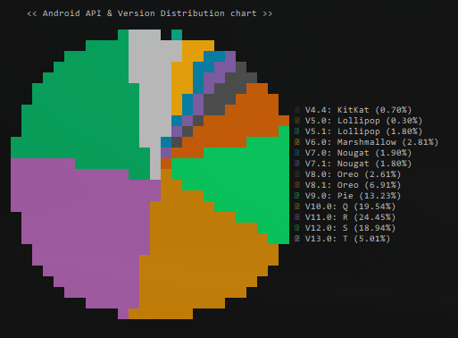

# android-api-versions-console-chart
Android api versions percentage usage chart for displaying in javascript/terminal using nodejs.



## Usage
To use android-api-versions-console-chart **on the terminal with node.js**, install [android-api-versions-console-chart from npm](https://www.npmjs.org/package/android-api-versions-console-chart) using the following command in the terminal:

```bash
npm install -g android-api-versions-console-chart
```


## Used libraries / Dependencies:

| Dependency library                                                | About                                                   |
|-------------------------------------------------------------------|---------------------------------------------------------|
| Random Color ([npmjs](https://www.npmjs.com/package/randomcolor)) | A tiny script for generating attractive random colors.  |
| Node Fetch ([npmjs](https://www.npmjs.com/package/node-fetch))    | A light-weight module that brings Fetch API to Node.js. |
| cli-pie ([npmjs](https://www.npmjs.com/package/cli-pie))          | Generate pie charts in terminal and text mode.          |

